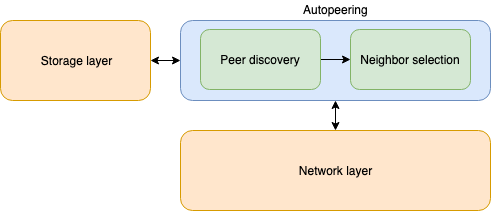
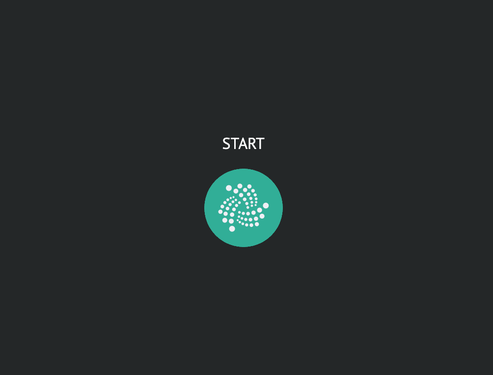
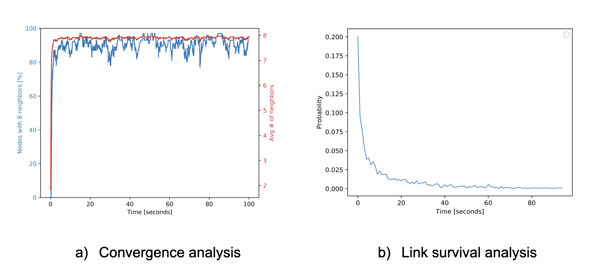

# Autopeering

In IOTA, a node is the machine owning all the information about the Tangle.
In order for the network to work efficiently, nodes exchange information each
other to be kept up-to-date about the new ledger state. Currently, a manual
peering process is used for nodes to mutually register as neighbors. However,
manual peering might be subject to attacks (e.g., social engineering) to affect
the network topology. To prevent these attacks, and to simplify the setup
process of new nodes, we introduce a mechanism that allows nodes to choose
their neighbors automatically. The process of nodes choosing their neighbors
without manual intervention by the node operator is called autopeering.

## Design

The autopeering module is logically divided into two main submodules: `peer discovery` and `neighbor selection`. The former is responsible for operations such as discovering new peers and verifying their online status while the latter is responsible for finding and managing neighbors for our node. It encapsulates the network and the storage layer through the use of Go interfaces.



## Motivation

This repository is where the IOTA Foundation's Research Team simulates tests on the Autopeering module to study and evaluate its performance.

By making this repository open source, the goal is to allow you to keep up with the development status and learn more about how it works.

Feel free to do your own simulations by following the steps below.

## Prerequisites

[Install Go](https://golang.org/doc/install) if it is not already installed on your machine. It is recommended that you use the most recent version of Go, or at least 1.13.

## Step 1. Build and run the simulation

1. Clone the repository

    ```bash
    git clone https://github.com/iotaledger/autopeering-sim.git
    ```

2. Enter into the `autopeering-sim` directory
    
    ```bash
    cd autopeering-sim
    ```

3. Build the Protocol Buffers to create / update the generated protobuf files.

    ```bash
    make compile
    ```

2. Enter into the `simulation` directory
    
    ```bash
    cd simulation
    ```

3. Build the executable file

    ```bash
    go build -o sim
    ```

4. If you want to change how the simulation behaves, edit the [parameters](#parameters) in the `input.txt` file

5. If you're using Windows, add the `.exe` file extension to the `sim` file

6. Run the simulation

    ```
    ./sim
    ```

7. If you have set the visualization as enabled, open your browser and go to `http://localhost:8844`.




## Step 2. Examine the data

To analyse the results of the simulation, read the `.csv` files in the `simulation/data` directory:

- *comvAnalysis*: Proportion of nodes with a complete neighborhood as a function of time
- *linkAnalysis*: Probability Density Function (PDF) of the time a given link stays active
- *msgAnalysis*: Number of peering requests sent, accepted, rejected, received and the number of connections dropped of each peer, as well as their average

## Step 3. Visualize the data

To use the Python script, you must have Python and PIP installed. The script output `.eps` files, so to view the graphs, you need an application that can open them.

1. Install the dependencies

    ```bash
    pip install numpy matplotlib
    ```

2. Run the script from the `simulation` folder

    ```
    python plot.py
    ```
The script provides two figures:
- The proportion of nodes with a complete neighborhood as a function of time
- The Probability Density Function (PDF) of the time a given link stays active

   

## Parameters

These parameters affect how the simulated autopeering behaves. As a result, changing these paramters has an affect on how long the protocol takes to converge.

A description and functionality of some of the parameters is provided in [the blog](need URL) that accompanies the release of this code.

To change any of these parameters, edit them in the `input.txt` file.

|   **Parameter**       |       **Type**    | **Description**    |
|-------------------|:-------------:|:--------------|    
|   `N`               |   int         | Number of peers |
|   `T`               |   int         | Salt lifetime, in seconds |
|   `SimDuration`     |   int         | Duration of the simulation, in seconds |
|   `VisualEnabled`   |   bool        | Enable/disable the visualization |
